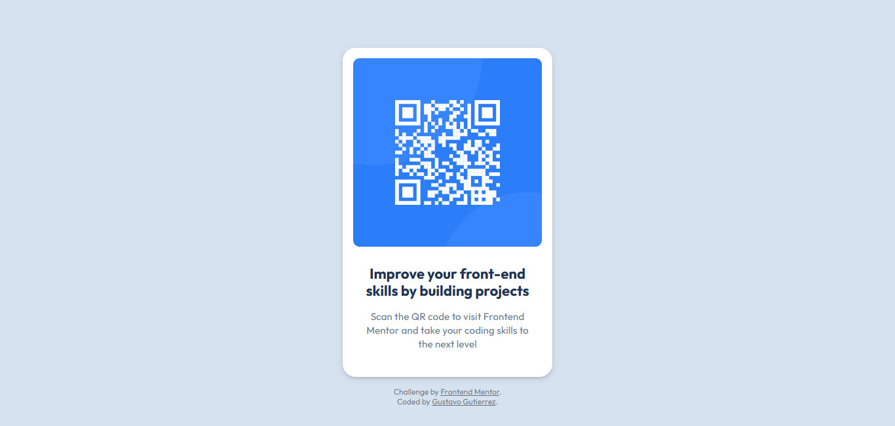

# Frontend Mentor - QR code component solution

This is a solution to the [QR code component challenge on Frontend Mentor](https://www.frontendmentor.io/challenges/qr-code-component-iux_sIO_H). Frontend Mentor challenges help you improve your coding skills by building realistic projects. 

## Table of contents

- [Overview](#overview)
  - [Screenshot](#screenshot)
  - [Links](#links)
- [My process](#my-process)
  - [Built with](#built-with)
  - [What I learned](#what-i-learned)
  - [Continued development](#continued-development)
  - [Useful resources](#useful-resources)
- [Author](#author)

## Overview

### Screenshot

### Links

- Solution URL: [Github repository](https://github.com/gustavo2023/qr-code-component)
- Live Site URL: [QR Component Webpage](https://gustavo2023.github.io/qr-code-component/)

## My process

### Built with

- Semantic HTML5 markup
- CSS custom properties

### What I learned

By working in this project I managed to get some solid beginner experience in working with a Figma design.
I also learned that it's important to avoid using pixel units when it comes to font-size, line-height and letter-spacing.

Aside from all taht, I would say that the best I learned was actually to work with source control using Git and Github, and how to host the project using Github Pages.

Previously I had very little experience using source control, at most I had created a few repositories for some college projects, but this time it actually felt like I was properly working with source control in an orderly way. Of coruse I still lack a lot of experience, but I'm getting the hang of it. 

As for hosting a project, this is the first time I have done it so it's something completely new for me, however it was quite easy.

### Continued development

For future projects I would like to continue to learn about the common best practices in web development.
I also have a little trouble understanding how responsiveness works so that's something I want to continue to study.

Aside from that I want to get a better understanding of the box-model to I can know better how to place different components exactly in the place I want them to be.

### Useful resources

- [Article](https://fedmentor.dev/posts/font-size-px/) - This helped me to understand why I souldn't use pixel units for font-size and instead to use other units that adapt better to changes in the browser settings of different users. 

## Author

- Frontend Mentor - [@gustavo2023](https://www.frontendmentor.io/profile/gustavo2023)
